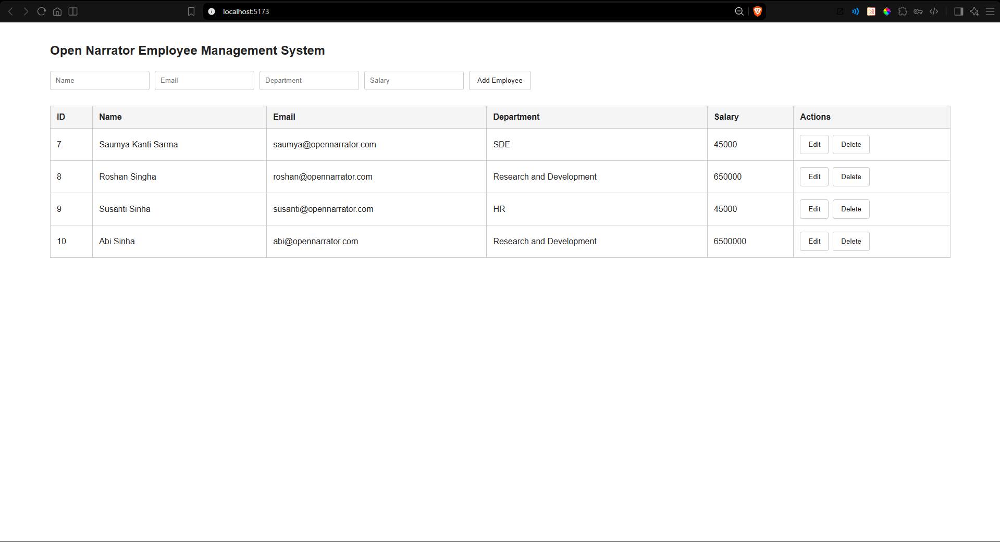

# Employee Management System 
> project work for DBMS 

This project is a full-stack employee management application built with React, Express, and Oracle Database. It allows users to add, view, update, and delete employee records through a browser interface. The frontend is designed as a simple dashboard for employee operations, while the backend handles business logic and database access.

## Dashboard



## Overview

The application follows a simple three-tier architecture:

1. Presentation tier: React frontend
2. Application tier: Express API server
3. Data tier: Oracle Database

The frontend sends HTTP requests to the Express API. The Express server connects to Oracle Database using the Oracle DB driver and performs SQL queries to manage employee records.


## Tech Stack

- Frontend: React + Vite
- Backend: Node.js + Express
- Database: Oracle Database with SQL PLUS
- Driver: oracledb (nodejs packahe)
- Communication: REST API with JSON
- Cross-origin handling: cors

## 3-Tier Architecture

The application is structured as a three-tier system:

### 1. Presentation Tier
The React frontend runs in the browser and provides the employee dashboard UI. It uses fetch requests to call the backend API.

### 2. Application Tier
The Express server receives HTTP requests, validates input, and executes the business logic. It interacts with the Oracle database and returns JSON responses to the frontend.

### 3. Data Tier
Oracle Database stores employee information. The backend connects to Oracle using connection details stored in environment variables and executes SQL statements such as INSERT, SELECT, UPDATE, and DELETE.

## Project Structure

```text
DBMS/
├── frontend/
│   ├── src/
│   ├── public/
│   ├── package.json
│   ├── vite.config.js
│   └── index.html
├── public/
│   └── dashboard.png
├── server/
│   ├── server.js
│   ├── example.env
│   ├── package.json
│   └── package-lock.json
├── README.md
└── .gitignore
```

## Oracle Database Connection

The backend connects to Oracle using the `oracledb` package. The database configuration is stored in the server environment variables.

```js
import express from "express";
import oracledb from "oracledb";
import dotenv from "dotenv";
import cors from "cors";

dotenv.config();

const app = express();
app.use(cors());
app.use(express.json());

const dbConfig = {
  user: process.env.DB_USER,
  password: process.env.DB_PASSWORD,
  connectString: process.env.DB_CONNECT_STRING
};
```

A sample environment configuration is shown below:

```env
DB_USER=system
DB_PASSWORD=your_password
DB_CONNECT_STRING=localhost:1521/XEPDB1
PORT=5000
```

This is how the Express server connects to the Oracle database:

```js
connection = await oracledb.getConnection(dbConfig);
```

The database is then queried using SQL statements such as SELECT, INSERT, UPDATE, and DELETE.

### Example database table

```sql
CREATE TABLE employees (
    employee_id NUMBER GENERATED BY DEFAULT AS IDENTITY PRIMARY KEY,
    name VARCHAR2(100) NOT NULL,
    email VARCHAR2(100) UNIQUE NOT NULL,
    department VARCHAR2(50),
    salary NUMBER(10,2)
);
```

Although the project uses Oracle Database through the Node.js driver, the database itself is still managed with SQL in the Oracle environment, which is compatible with the SQL concepts used in SQL Plus.

## How Express Connects to the Frontend

The React frontend does not connect directly to Oracle Database. Instead, it calls the Express REST API.

### Frontend request example

```js
const API_URL = "http://localhost:5000/employees";

const response = await fetch(API_URL);
const data = await response.json();
```

### Backend API setup

```js
app.use(cors());
app.use(express.json());
```

This allows the React app running on a different port to communicate with the backend safely and receive JSON data.

## API Routes

The backend exposes the following REST API endpoints:

| Method | Route | Description | Response |
| --- | --- | --- | --- |
| POST | /employees | Create a new employee | 201 Created with employee_id |
| GET | /employees | Get all employees | JSON array of employees |
| GET | /employees/:id | Get employee details by ID | JSON employee object |
| PUT | /employees/:id | Update employee details | Success message |
| DELETE | /employees/:id | Delete employee by ID | Success message |

### Request and Response Example

#### Create employee

Request:

```http
POST /employees
Content-Type: application/json
```

Body:

```json
{
  "name": "John Doe",
  "email": "john@example.com",
  "department": "IT",
  "salary": 75000
}
```

Response:

```json
{
  "message": "Employee created successfully",
  "employee_id": 1
}
```

#### Get all employees

```http
GET /employees
```

Response:

```json
[
  {
    "EMPLOYEE_ID": 1,
    "NAME": "John Doe",
    "EMAIL": "john@example.com",
    "DEPARTMENT": "IT",
    "SALARY": 75000
  }
]
```

## Frontend Behavior

The React frontend displays employee records in a table and provides actions for:

- Add employee
- Edit employee
- Delete employee
- Cancel edit

When a user submits a form, the app sends the data to the API and refreshes the list after a successful operation.

## Running the Project

### 1. Install backend dependencies

```bash
cd server
npm install
```

### 2. Configure environment variables

Create a .env file in the server folder using the values from `example.env`.

### 3. Start the backend

```bash
npm run dev
```

The server will run on:

```text
http://localhost:5000
```

### 4. Install frontend dependencies

```bash
cd ../frontend
npm install
```

### 5. Start the frontend

```bash
npm run dev
```

The React app will run on the Vite default port:

```text
http://localhost:5173
```

## Database and API Flow

The application follows this flow:

```text
React Frontend
      |
      v
Express API
      |
      v
Oracle Database
```

1. User interacts with the React UI.
2. Frontend sends HTTP requests to Express.
3. Express connects to Oracle with oracledb.
4. SQL is executed against the database.
5. Results are returned as JSON to the frontend.
6. Frontend updates the UI.

## Notes

This project is a basic CRUD system that demonstrates how a React frontend, an Express backend, and an Oracle database can work together in a modern web application. It is ideal for learning full-stack application development, REST APIs, and database integration.
